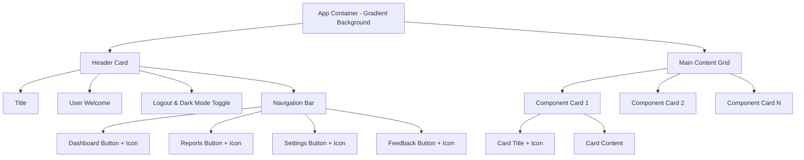

# App Interface Styling Design Specification

## Overview
This specification outlines the modern styling updates for the main app interface after login, replicating the card-like layouts, gradients, icons, animations, and consistent CSS variables from the login page. The goal is to create a cohesive, visually appealing, and accessible user experience in both light and dark modes.

## Current State Analysis
- **App.tsx**: Uses inline styles with theme variables; basic layout with header, navigation buttons, and content area.
- **Components**: ExpenseList, BudgetProgress, etc., use inline styles with minimal styling (basic borders, padding).
- **Login Page**: Features modern card design with gradients, shadows, rounded corners, icons (Lucide React), and smooth animations.
- **Themes**: CSS variables defined in `themes.css` for light/dark modes.
- **Dependencies**: Lucide React already installed.

## Design Principles
- **Card-like Layouts**: All major sections use card backgrounds with rounded corners, shadows, and subtle gradients.
- **Consistency**: Leverage existing CSS variables from `themes.css`.
- **Icons**: Use Lucide React icons for navigation and interactive elements.
- **Animations**: Smooth transitions and hover effects for better UX.
- **Accessibility**: Maintain high contrast, readable fonts, and keyboard navigation support.
- **Responsiveness**: Ensure layouts work on various screen sizes.

## Layout Changes

### Overall Layout (App.tsx)
- **Container**: Apply gradient background similar to login page (`linear-gradient(135deg, var(--bg-primary) 0%, var(--bg-secondary) 100%)`), full height, centered content.
- **Header**: Card-style background with shadow, centered title, user welcome section.
- **Main Content**: Grid or flex layout for dashboard components, each wrapped in cards with spacing.

#### CSS Classes for App.tsx
```css
.app-container {
  min-height: 100vh;
  background: linear-gradient(135deg, var(--bg-primary) 0%, var(--bg-secondary) 100%);
  padding: 20px;
  transition: background 0.3s ease;
}

.app-header {
  background: var(--bg-primary);
  border-radius: 16px;
  box-shadow: 0 8px 32px var(--shadow);
  padding: 32px;
  margin-bottom: 32px;
  text-align: center;
  transition: transform 0.3s ease, box-shadow 0.3s ease;
}

.app-header:hover {
  transform: translateY(-2px);
  box-shadow: 0 12px 40px var(--shadow);
}

.app-title {
  color: var(--text-primary);
  font-size: 32px;
  font-weight: 600;
  margin: 0 0 16px 0;
}

.user-welcome {
  color: var(--text-secondary);
  font-size: 18px;
  margin-bottom: 16px;
}

.logout-section {
  display: flex;
  justify-content: center;
  align-items: center;
  gap: 16px;
  margin-bottom: 24px;
}

.app-nav {
  display: flex;
  justify-content: center;
  gap: 12px;
  flex-wrap: wrap;
}

.nav-button {
  background: var(--bg-primary);
  color: var(--accent);
  border: 2px solid var(--accent);
  border-radius: 12px;
  padding: 12px 24px;
  font-size: 16px;
  font-weight: 500;
  cursor: pointer;
  transition: all 0.3s ease;
  display: flex;
  align-items: center;
  gap: 8px;
}

.nav-button:hover {
  background: var(--accent);
  color: var(--bg-primary);
  transform: translateY(-2px);
  box-shadow: 0 4px 16px rgba(0, 123, 255, 0.3);
}

.nav-button.active {
  background: var(--accent);
  color: var(--bg-primary);
}

.main-content {
  display: grid;
  grid-template-columns: repeat(auto-fit, minmax(400px, 1fr));
  gap: 24px;
  max-width: 1200px;
  margin: 0 auto;
}
```

#### Navigation Bar Icons
- Dashboard: `LayoutDashboard` icon
- Monthly Reports: `BarChart3` icon
- Settings: `Settings` icon
- Feedback: `MessageSquare` icon

### Dashboard Components
All components will be wrapped in card containers with consistent styling.

#### Component Card Wrapper
```css
.component-card {
  background: var(--bg-primary);
  border: 1px solid var(--border);
  border-radius: 16px;
  box-shadow: 0 4px 16px var(--shadow);
  padding: 24px;
  transition: transform 0.3s ease, box-shadow 0.3s ease;
}

.component-card:hover {
  transform: translateY(-4px);
  box-shadow: 0 8px 24px var(--shadow);
}

.component-title {
  color: var(--text-primary);
  font-size: 24px;
  font-weight: 600;
  margin: 0 0 16px 0;
  display: flex;
  align-items: center;
  gap: 8px;
}
```

#### ExpenseList Updates
- Use `.component-card` wrapper.
- Add icon to title: `Receipt` icon.
- Enhance list items with better spacing, hover effects.
- Anomalous items: Add subtle animation (pulse effect).

#### BudgetProgress Updates
- Use `.component-card` wrapper.
- Add icon to title: `TrendingUp` icon.
- Improve progress bar styling with gradients.
- Add percentage text with color coding.

#### Other Components
Apply similar card styling to AddExpenseForm, SetBudgetForm, AIInsights, SpendingCharts, etc. Add relevant icons to titles.

## Consistency and Enhancements
- **Gradients**: Subtle gradients on cards and backgrounds using `--bg-primary` and `--bg-secondary`.
- **Icons**: Lucide React icons for all interactive elements and section headers.
- **Transitions**: 0.3s ease transitions for all state changes.
- **Shadows**: Consistent box-shadow using `var(--shadow)`.

## Accessibility Considerations
- **Color Contrast**: Ensure text meets WCAG AA standards (4.5:1 ratio).
- **Focus States**: Add visible focus indicators for keyboard navigation.
- **Readable Fonts**: Use system fonts with appropriate sizes.
- **Dark Mode**: Verify all elements are readable in dark theme.

## New Dependencies
None required. Lucide React is already installed.

## Implementation Notes
- Convert App.tsx from inline styles to CSS classes.
- Create `App.css` file for new styles.
- Update component files to use CSS classes instead of inline styles.
- Test in both light and dark modes.
- Ensure responsive design with media queries if needed.

## Mermaid Diagram: App Layout Structure


This specification provides a comprehensive plan for modernizing the app interface while maintaining consistency with the login page design.