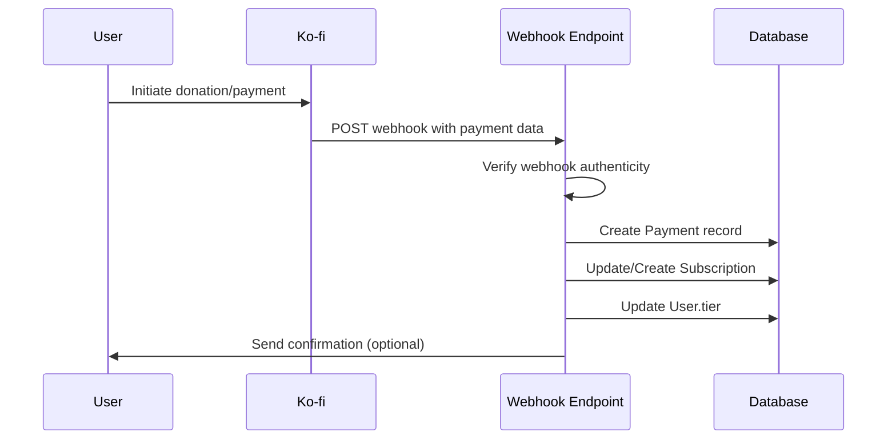

# Ko-fi API Integration Plan for Personal Financial Tracker

## Current State Analysis

### Subscription Component
- Displays three tiers: Free, Premium ($5/month), Business ($10/month)
- Static links to Ko-fi donation pages with preset amounts
- No dynamic tier display or subscription management

### Backend Models
- User model has `tier` field (default "FREE")
- No dedicated subscription or payment tracking models
- No Ko-fi integration endpoints

## Ko-fi API Capabilities
- Supports webhooks for payment notifications (HTTP POST to specified URL)
- No direct API for subscription management or recurring payment automation
- Recurring payments handled as user-initiated monthly donations
- Public API available for retrieving supporter information (not used for payments)

## Integration Architecture

### Webhook Implementation
- Create `/api/webhooks/kofi` endpoint in backend
- Handle POST requests from Ko-fi with payment data
- Verify webhook authenticity using Ko-fi's verification method (IP whitelist or signature if available)

### Database Schema Updates
Add new models:
```
model Subscription {
  id        Int      @id @default(autoincrement())
  userId    Int
  tier      String   // "PREMIUM" or "BUSINESS"
  amount    Float
  status    String   @default("ACTIVE") // ACTIVE, CANCELLED, EXPIRED
  startDate DateTime @default(now())
  endDate   DateTime?
  kofiId    String?  // Ko-fi transaction ID
  user      User     @relation(fields: [userId], references: [id])
}

model Payment {
  id          Int      @id @default(autoincrement())
  userId      Int
  amount      Float
  currency    String   @default("USD")
  status      String   // SUCCESS, FAILED, PENDING
  kofiId      String   @unique
  timestamp   DateTime @default(now())
  subscriptionId Int?
  user        User     @relation(fields: [userId], references: [id])
  subscription Subscription? @relation(fields: [subscriptionId], references: [id])
}
```

### User Tier Update Logic
- Upon successful webhook receipt:
  - Identify user by email from webhook data
  - Create/update Subscription record
  - Update User.tier based on amount (5=PREMIUM, 10=BUSINESS)
  - For recurring: Extend subscription endDate by 1 month

### Subscription Management
- Frontend: Add subscription status display in Subscription component
- Backend: Add endpoints for viewing subscription history, cancelling (if applicable)
- Since Ko-fi doesn't support automated cancellation, handle as status update

## Security Considerations
- Webhook verification: Use Ko-fi's recommended verification (check source IP, validate signature)
- Rate limiting on webhook endpoint
- Input validation and sanitization
- Store sensitive data securely (API keys, secrets)
- HTTPS required for webhook endpoint

## Error Handling
- Log all webhook attempts and failures
- Retry failed operations with exponential backoff
- Notify users of payment issues via email
- Graceful degradation: Maintain current tier if webhook fails
- Monitoring: Alert on unusual payment patterns

## Implementation Steps
1. Update Prisma schema with new models
2. Create webhook endpoint with verification
3. Implement payment processing logic
4. Update user tier management
5. Add subscription management UI
6. Implement security measures
7. Add comprehensive error handling
8. Test with Ko-fi sandbox/test webhooks

## Workflow Diagram



## Risks and Limitations
- Ko-fi's lack of automated subscription management may require manual intervention for cancellations
- Recurring payments depend on user action, not automated billing
- Potential for payment delays affecting tier updates
- Dependency on Ko-fi's service availability