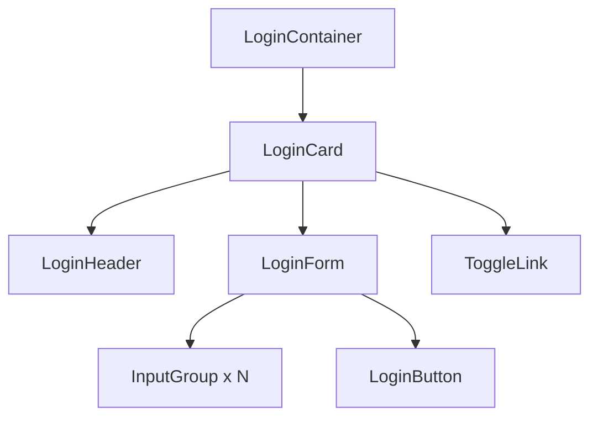

# Login Page Design Specification

## Overview
This specification outlines the improvements to the Login.tsx component to address dark mode visibility issues and enhance visual appeal. The design integrates seamlessly with the existing theme system using CSS variables from themes.css.

## Key Improvements
1. **Dark Mode Support**: All elements use theme variables for consistent light/dark mode appearance.
2. **Persistence**: Dark mode preference persists as a user preference (no reset on sign out).
3. **Modern Appeal**: Card-based layout with gradients, icons, animations, and improved typography.

## Layout Structure
```
LoginContainer (full-screen gradient background)
└── LoginCard (centered card with shadow)
    ├── Header (title with icon)
    ├── Form
    │   ├── InputGroup (for each field)
    │   │   ├── Icon
    │   │   └── Input
    │   └── Button (styled submit button)
    └── ToggleLink (switch between login/register)
```

## CSS Classes and Theme Integration

### Container Styles
```css
.login-container {
  min-height: 100vh;
  background: linear-gradient(135deg, var(--bg-primary) 0%, var(--bg-secondary) 100%);
  display: flex;
  align-items: center;
  justify-content: center;
  padding: 20px;
}

.login-card {
  background: var(--bg-primary);
  border: 1px solid var(--border);
  border-radius: 16px;
  box-shadow: 0 8px 32px var(--shadow);
  padding: 40px;
  max-width: 400px;
  width: 100%;
  transition: transform 0.3s ease, box-shadow 0.3s ease;
}

.login-card:hover {
  transform: translateY(-2px);
  box-shadow: 0 12px 40px var(--shadow);
}
```

### Header Styles
```css
.login-header {
  text-align: center;
  margin-bottom: 32px;
}

.login-title {
  color: var(--text-primary);
  font-size: 28px;
  font-weight: 600;
  margin: 0 0 8px 0;
}

.login-subtitle {
  color: var(--text-secondary);
  font-size: 16px;
  margin: 0;
}
```

### Form Styles
```css
.login-form {
  display: flex;
  flex-direction: column;
  gap: 24px;
}

.input-group {
  position: relative;
}

.input-icon {
  position: absolute;
  left: 12px;
  top: 50%;
  transform: translateY(-50%);
  color: var(--text-secondary);
  z-index: 1;
}

.login-input {
  width: 100%;
  padding: 12px 12px 12px 40px;
  border: 2px solid var(--border);
  border-radius: 8px;
  background: var(--bg-primary);
  color: var(--text-primary);
  font-size: 16px;
  transition: border-color 0.3s ease, box-shadow 0.3s ease;
  box-sizing: border-box;
}

.login-input:focus {
  outline: none;
  border-color: var(--accent);
  box-shadow: 0 0 0 3px rgba(var(--accent), 0.1);
}

.login-input::placeholder {
  color: var(--text-secondary);
}
```

### Button Styles
```css
.login-button {
  background: var(--accent);
  color: white;
  border: none;
  border-radius: 8px;
  padding: 12px 24px;
  font-size: 16px;
  font-weight: 600;
  cursor: pointer;
  transition: background-color 0.3s ease, transform 0.2s ease;
  width: 100%;
}

.login-button:hover {
  background: var(--accent-hover);
  transform: translateY(-1px);
}

.login-button:active {
  transform: translateY(0);
}

.login-button:disabled {
  background: var(--text-secondary);
  cursor: not-allowed;
  transform: none;
}
```

### Toggle Link Styles
```css
.toggle-link {
  background: none;
  border: none;
  color: var(--accent);
  cursor: pointer;
  font-size: 14px;
  text-align: center;
  margin-top: 16px;
  transition: color 0.3s ease;
}

.toggle-link:hover {
  color: var(--accent-hover);
  text-decoration: underline;
}
```

## Component Structure (React)
```tsx
import React, { useState } from 'react';
import { Mail, Lock, User } from 'lucide-react'; // Icon library

const Login: React.FC<LoginProps> = ({ onLogin }) => {
  // State management (unchanged)

  return (
    <div className="login-container">
      <div className="login-card">
        <div className="login-header">
          <h2 className="login-title">
            {isRegister ? 'Create Account' : 'Welcome Back'}
          </h2>
          <p className="login-subtitle">
            {isRegister ? 'Sign up to get started' : 'Sign in to your account'}
          </p>
        </div>
        <form className="login-form" onSubmit={handleSubmit}>
          {isRegister && (
            <div className="input-group">
              <User className="input-icon" size={20} />
              <input
                className="login-input"
                type="text"
                placeholder="Full Name"
                value={name}
                onChange={(e) => setName(e.target.value)}
                required
              />
            </div>
          )}
          <div className="input-group">
            <Mail className="input-icon" size={20} />
            <input
              className="login-input"
              type="email"
              placeholder="Email Address"
              value={email}
              onChange={(e) => setEmail(e.target.value)}
              required
            />
          </div>
          <div className="input-group">
            <Lock className="input-icon" size={20} />
            <input
              className="login-input"
              type="password"
              placeholder="Password"
              value={password}
              onChange={(e) => setPassword(e.target.value)}
              required
            />
          </div>
          <button className="login-button" type="submit">
            {isRegister ? 'Create Account' : 'Sign In'}
          </button>
        </form>
        <button className="toggle-link" onClick={() => setIsRegister(!isRegister)}>
          {isRegister ? 'Already have an account? Sign In' : 'Need an account? Sign Up'}
        </button>
      </div>
    </div>
  );
};
```

## Additional Libraries
- **Lucide React**: For icons (Mail, Lock, User). Install with `npm install lucide-react`.
- **Framer Motion** (optional): For advanced animations if needed. Install with `npm install framer-motion`.

## Implementation Notes
- All styles use CSS variables from themes.css for theme consistency.
- Animations are CSS-based for performance.
- Responsive design with max-width and padding.
- Accessibility: Proper labels, focus states, and semantic HTML.

## Mermaid Diagram: Component Hierarchy


This specification provides a complete blueprint for the updated login page with modern design and full theme integration.